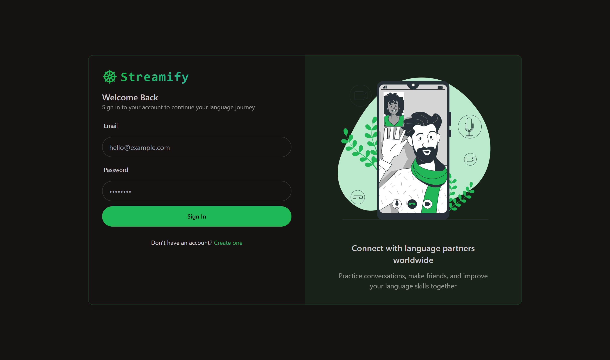
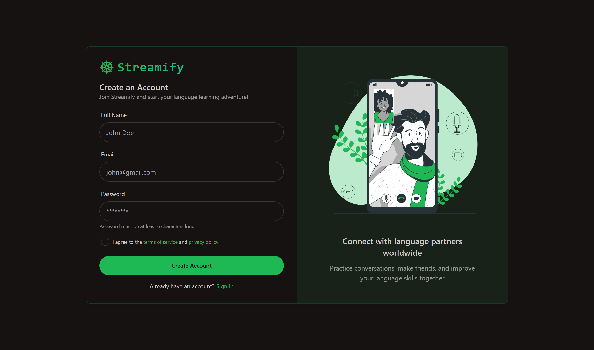

# ✨ Streamify

> A full-stack real-time language exchange and messaging platform with video calls, friend requests, 32 UI themes, and Stream-powered chat infrastructure.


### Login & Sign Up

| Login | Sign Up |
|-------|---------|
|  |  |

---

## ✨ Features

- 💬 **Real-time messaging** — typing indicators, emoji reactions
- 📹 **Video calls** — 1-on-1 and group with screen sharing & recording (Stream SDK)
- 👥 **Friend system** — send, accept, decline friend requests
- 🌍 **Language exchange** — match with learners of languages you speak
- 🎨 **32 UI themes** — DaisyUI theme switcher
- 🔐 **JWT authentication** — protected routes, HttpOnly cookie sessions
- ⚡ **TanStack Query** — smart caching and background refetching
- 🧠 **Zustand** — global client state management
- 🚨 **Error handling** — unified error responses on both frontend and backend

---

## 🗂️ Project Structure

```
Streamify/
├── backend/
│   └── src/
│       ├── server.js                 # Express entry point
│       ├── controllers/
│       │   ├── auth.controller.js
│       │   ├── user.controller.js
│       │   └── chat.controller.js
│       ├── models/
│       │   ├── User.js
│       │   └── FriendRequest.js
│       ├── routes/
│       │   ├── auth.route.js
│       │   ├── user.route.js
│       │   └── chat.route.js
│       └── lib/
│           ├── db.js                 # MongoDB connect
│           └── stream.js             # Stream SDK init
└── frontend/
    └── src/                          # React + Zustand + TanStack Query
```

---

## 🚀 Getting Started

### Backend

```bash
cd backend
npm install
cp .env.example .env  # fill in values
npm run dev
```

### Frontend

```bash
cd frontend
npm install
npm run dev
```

---

## ⚙️ Environment Variables

### Backend (`/backend/.env`)

```env
PORT=5001
MONGO_URI=your_mongodb_uri
STEAM_API_KEY=your_stream_api_key
STEAM_API_SECRET=your_stream_api_secret
JWT_SECRET_KEY=your_jwt_secret
NODE_ENV=development
```

### Frontend (`/frontend/.env`)

```env
VITE_STREAM_API_KEY=your_stream_api_key
```

---

## 🛠️ Tech Stack

| Layer | Technology |
|-------|-----------|
| Frontend | React, Zustand, TanStack Query, TailwindCSS, DaisyUI |
| Backend | Node.js, Express.js |
| Database | MongoDB + Mongoose |
| Real-time | Stream Chat & Video SDK |
| Auth | JWT + HttpOnly cookies |

---

## 👨‍💻 Author

**Jeetu Pal**
[](https://github.com/jeetupal31)

---

## 📄 License

MIT
